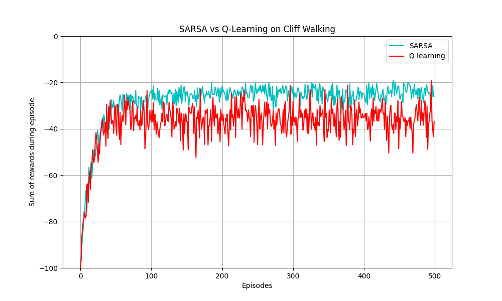
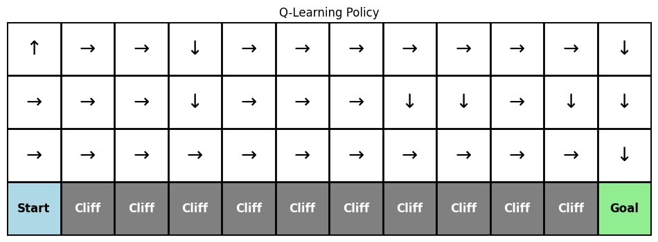
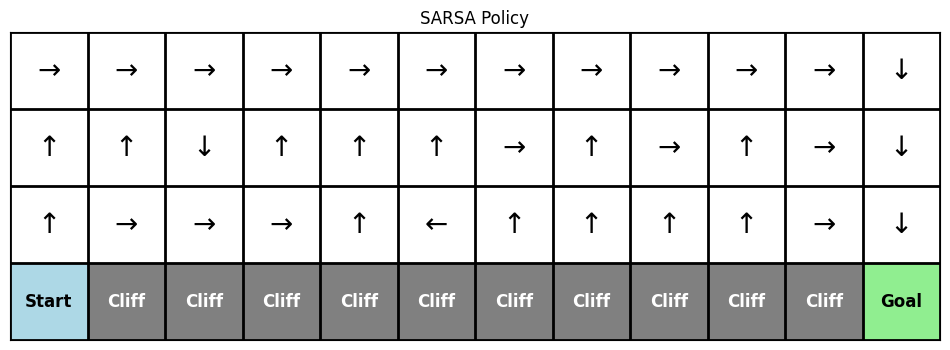

# 強化學習作業二：Cliff Walking (Q-learning vs SARSA) 分析報告

## 一、實驗設定
- **環境**：4x12 的 Cliff Walking Gridworld。
- **起點**：(3, 0) 左下角。
- **終點**：(3, 11) 右下角。
- **懸崖**：(3, 1) 到 (3, 10) 底部區域，掉入懸崖會獲得 -100 獎勵並回到起點。
- **一般步數獎勵**：-1。
- **超參數**：學習率 $\alpha = 0.5$，折扣因子 $\gamma = 1.0$，探索率 $\epsilon = 0.1$。
- **訓練次數**：每種演算法訓練 500 回合，並重複進行 50 次獨立實驗以取平均值來繪製平滑曲線。

---

## 二、結果分析

### 1. 學習表現 (Learning Performance)

如上圖的累積獎勵（Sum of rewards during episode）曲線所示：
- **SARSA** 在早期的表現較差，但收斂後其每回合的平均累積獎勵穩定在較高的水平（約 -20 左右）。這表明 SARSA 學會了在考慮到偶爾會因 $\epsilon$-greedy 發生隨機探索的情況下，如何最大化收益並避免掉下懸崖的災難性後果。
- **Q-learning** 的學習曲線即使在收斂後，每回合的平均累積獎勵仍然在 -40 左右，低於 SARSA。這是因為 Q-learning 學到了理論上的最短路徑（貼著懸崖邊走），但實際執行策略時 ($\epsilon$-greedy) 仍有 10% 的機率隨機選擇動作，導致它有較高的機率不慎掉入懸崖，從而遭受 -100 的懲罰。

### 2. 策略行為 (Policy Behavior)

經過訓練後，兩種演算法最終學習到的 Greedy Policy 路徑如下：

**Q-learning 最終路徑 (貼崖走)：**

- **傾向**：冒險（Risk-seeking）。
- **分析**：Q-learning 會選擇沿著懸崖邊緣（第三排）的最短路徑。由於這條路徑所需步數最少，理論上能獲得最高的報酬（扣除最少的 -1）。

**SARSA 最終路徑 (繞遠路)：**

- **傾向**：保守（Risk-averse）。
- **分析**：SARSA 學習到遠離懸崖的安全路徑（從上方繞過）。因為 SARSA 是 On-policy，它會把 $\epsilon$-greedy 帶來的不確定性納入更新考量。走在懸崖邊一旦發生隨機探索，掉落的風險太高，因此它寧願多走幾步（多扣幾分）來確保絕對的安全。

### 3. 穩定性分析

- **波動程度**：由學習曲線可以看出，即便取了 50 次平均，Q-learning 收斂後的波動度依舊略高於 SARSA，且由於經常觸發 -100 的懲罰，其平均報酬遠低於 SARSA。
- **探索 (Exploration) 的影響**：$\epsilon$-greedy 的探索機制對這兩種演算法的影響不同。對 Q-learning 來說，探索是外部的「雜訊」，不影響它對最佳路徑的認知；但對 SARSA 來說，探索是「實際經驗」的一部分，因此 SARSA 選擇了一條能夠容忍這 10% 探索錯誤的安全路徑。

---

## 三、理論比較與討論

- **Q-learning 為離策略（Off-policy）**：
  Q-learning 的更新公式為 $Q(S, A) \leftarrow Q(S, A) + \alpha [R + \gamma \max_{a} Q(S', a) - Q(S, A)]$。
  它在更新時總是假設在下一個狀態會採取**最佳行動** ($\max_{a} Q$)，而忽略了實際上代理人仍在依循 $\epsilon$-greedy 進行探索。因此，即使代理人可能因為探索而掉入懸崖，Q-learning 仍認為這條捷徑是最佳的。
  
- **SARSA 為同策略（On-policy）**：
  SARSA 的更新公式為 $Q(S, A) \leftarrow Q(S, A) + \alpha [R + \gamma Q(S', A') - Q(S, A)]$。
  它的更新是基於**實際執行的下一個動作** ($A'$，包含了探索機率)。因此，如果在懸崖邊探索導致掉落，這個巨大的負回報會直接更新到當前的 $Q(S, A)$ 中，迫使 SARSA 去尋找更安全的路線。

---

## 四、結論

1. **哪一種方法收斂較快**：
   在累積獎勵的提升上，SARSA 通常在早期會比較快達到一個較高且穩定的回報值，因為它很快就學會了避開懸崖。Q-learning 雖然也很快學到了最短路徑，但由於在訓練期間仍需執行 $\epsilon$-greedy，導致其線上（Online）表現一直被懸崖懲罰拖累。

2. **哪一種方法較穩定**：
   **SARSA** 較穩定。它學到的策略考慮了自身的探索風險，因此線上執行的表現（Online Performance）波動較小，平均報酬更高。

3. **在何種情境下應選擇 Q-learning 或 SARSA**：
   - **選擇 Q-learning**：如果訓練階段的代價不高（例如在模擬器中），並且最終我們關心的是如何找到**絕對的最佳/最短路徑**，且在實際上線後會將探索率 $\epsilon$ 降為 0（完全 Greedy）。
   - **選擇 SARSA**：如果代理人在學習過程中所犯的錯誤會造成嚴重的實質損失（例如真實世界的機器人、無人車），或者環境中本身就存在無法消除的隨機性（例如風、滑溜的地面），則應選擇 SARSA，因為它能學會容錯率較高的安全策略。
